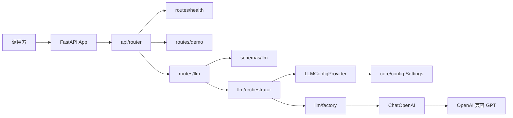
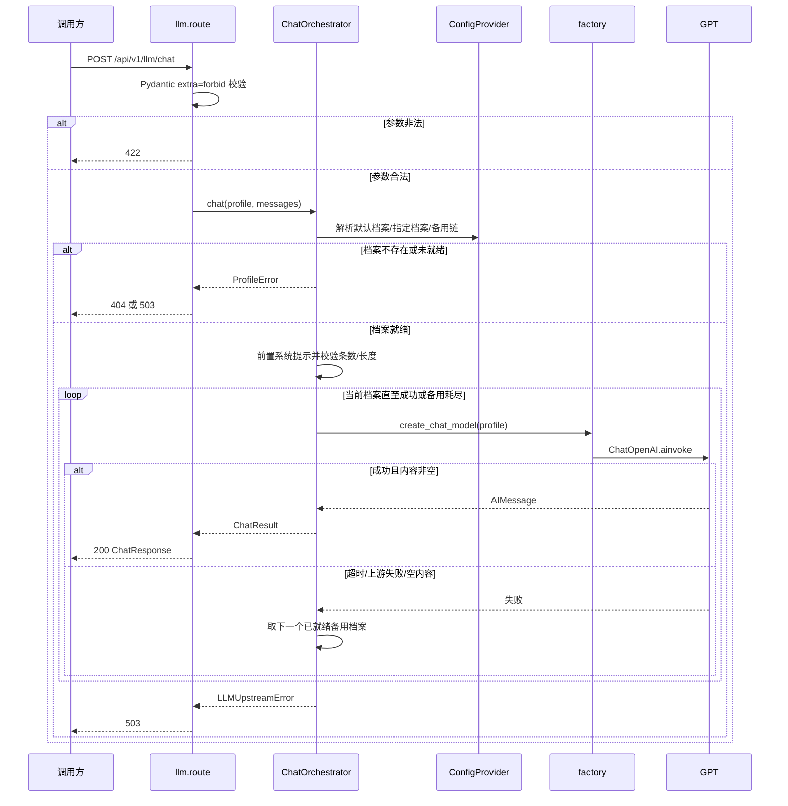

# LLM 接入与编排基础能力详细设计

## 1. 文档信息

| 项目 | 内容 |
| --- | --- |
| 设计编号 | DESIGN-REQ-2026-001 |
| 关联需求 | [REQ-2026-001-llm-access-orchestration.md](../requirements/REQ-2026-001-llm-access-orchestration.md) |
| 关联数据库设计 | 不涉及 |
| 关联测试文档 | [TEST-REQ-2026-001-llm-access-orchestration.md](../test/TEST-REQ-2026-001-llm-access-orchestration.md) |
| 文档版本 | 0.2 |
| 文档状态 | 开发中 |
| 技术负责人 | 待指定 |
| 创建/更新日期 | 2026-09-11 |

## 2. 设计摘要

### 2.1 目标

1. 在 FastAPI 中增加独立的 LLM 配置访问边界、模型工厂和单步编排，调用方只按档案名使用模型。
2. 提供档案列表、同步对话、SSE 流式对话三个 HTTP 接口；第一期用 OpenAI 兼容协议调用 GPT。
3. 模型名、超时、消息上限等全部从配置读取；缺少密钥时服务仍可启动，现有 `/health` 与 Demo 不受影响。
4. 主档案上游失败后按配置尝试备用档案；全部失败返回明确错误，不把空文本当成功。

### 2.2 非目标

- 不引入独立 LLM 网关，不安装各厂商官方伙伴包作为默认后端。
- 不把配置接入数据库，不创建配置表，不提供档案写入 API。
- 不提供结构化输出接口、多步 LangGraph、Agent、会话持久化。
- 不实现登录、认证、权限、审计、脱敏。
- 不修改 Demo 内存存储语义。

### 2.3 需求映射

| 需求/验收标准 | 设计落点 | 验证方式 |
| --- | --- | --- |
| REQ-001 / AC-001 | `GET /api/v1/llm/profiles` + `SettingsLLMConfigProvider` | pytest：配置就绪档案后列表含 `smart` 且 `ready=true`，无密钥字段 |
| REQ-001 / AC-002 | 档案 `api_key` 为空则 `ready=false` | pytest：缺密钥档案标记未就绪或不作为可调用项 |
| REQ-001 / AC-003 | 启动不校验 LLM 密钥；`/health` 不依赖 LLM | pytest：无密钥时 health 仍 200 |
| REQ-001 / AC-025 | `ChatOpenAI(model=profile.model)`，模型名只来自配置 | pytest：替换配置中的 model 后 fake 客户端收到新模型名 |
| REQ-001 / AC-026 | 编排前按配置校验 `max_messages` | pytest：上限为 1 时两条消息返回 422 且不调用上游 |
| REQ-002 / AC-004 | 请求体仅 `profile` + `messages` | pytest：成功响应无密钥 |
| REQ-002 / AC-005 | `ChatRequest` `extra="forbid"` | pytest：携带 `api_key`/`model`/`base_url`/`provider` 返回 422 |
| REQ-002 / AC-006 | 路由不出现供应商字段 | 静态检查 + pytest：只改配置不改路径 |
| REQ-003 / AC-007 | `POST /api/v1/llm/chat` 省略 profile 用默认档案 | pytest：返回非空 `content` 和实际 `profile` |
| REQ-003 / AC-008 | 请求 `profile=fast` | pytest：响应 `profile=fast` |
| REQ-003 / AC-009 | 空消息、非法 role、超上限 | pytest：422 且 fake 上游调用次数为 0 |
| REQ-004 / AC-010 | `POST /api/v1/llm/chat/stream`，`text/event-stream` | pytest：Content-Type 正确且至少一条 `delta` |
| REQ-004 / AC-011 | 流式接口先校验再开流 | pytest：非法请求 JSON 422，不是 SSE |
| REQ-004 / AC-012 | SSE `event: error` 后结束 | pytest：上游中途失败可区分未完成 |
| REQ-005 / AC-013、AC-014 | 不实现 | 不适用 |
| REQ-006 / AC-015 | `ChatOrchestrator` 按 fallbacks 顺序切换 | pytest：主档案失败、备用成功，响应档案为备用 |
| REQ-006 / AC-016 | 全部失败 `LLMUpstreamError` → 503 | pytest：非 2xx，无空成功文本 |
| REQ-006 / AC-017 | 校验失败不进入转移 | pytest：422 且上游次数为 0 |
| REQ-007 / AC-018 | 组装时前置 `system_prompt` | pytest：fake 模型收到的首条为配置中的系统策略 |
| REQ-007 / AC-019 | 不实现 | 不适用 |
| REQ-008 / AC-020 | `ChatOpenAI(timeout=profile.timeout_seconds, max_retries=0)` | pytest：超时映射为上游失败 |
| REQ-008 / AC-021 | 空内容视为上游失败 | pytest：空 content 不返回 200 成功 |
| REQ-009 / AC-022 | 响应模型不含密钥字段 | pytest 断言响应 JSON |
| REQ-009 / AC-023 | 日志只记档案名和错误类型 | 代码审查 + 单测补丁 logger |
| REQ-009 / AC-024 | `.env.example` 占位 | 静态检查 |
| REQ-010 / AC-027 | 无表、无档案 CRUD 路由 | 静态检查路由与 `doc/sql` |
| REQ-010 / AC-028 | Settings 中 GPT 档案 + 有效密钥可对话 | 隔离 fake 上游 pytest；真实 GPT 为手工联调 |
| REQ-010 / AC-029 | HTTP 契约无 `source=env/db` 字段 | pytest 响应字段白名单 |

## 3. 改动范围

| 层次 | 模块/路径 | 主要改动 |
| --- | --- | --- |
| 应用入口 | `app/main.py` | 不改根路径；可通过 FastAPI `Depends` 使用单例编排器，不必改欢迎信息 |
| 路由 | `app/api/routes/llm.py`、`app/api/router.py` | 新增 llm 路由，挂到 `settings.api_v1_prefix` |
| Schema | `app/schemas/llm.py` | 档案列表、对话请求/响应、用量、错误体 |
| 配置 | `app/core/config.py`、`.env.example` | 增加嵌套 `llm` 配置；`env_nested_delimiter="__"` |
| LLM 内核 | `app/llm/` | 配置提供者、工厂、编排、领域错误 |
| 数据 | 不涉及 | 不落库、不改 Demo 内存存储 |
| 依赖 | `pyproject.toml` | 增加 `langchain-core`、`langchain-openai` |
| 测试 | `tests/test_llm.py`、`tests/conftest.py` | TestClient + 可注入的 fake 配置/模型 |
| 调用方 | 新接口 | 旧接口保持兼容 |

## 4. 架构与流程

### 4.1 架构图



路由和编排只依赖 `LLMConfigProvider` 与 `BaseChatModel`，不直接读环境变量名，也不直接 `import ChatOpenAI`。后续若配置改从数据库读取，替换 Provider 实现即可，HTTP 契约不变。

### 4.2 关键时序图

同步对话（含失败转移）：



SSE 流式：校验与档案解析同同步；成功进入生成后 `astream`，每个文本块发 `delta`，正常结束发 `done`，中途失败发 `error` 后关闭。

### 4.3 主要流程

1. 路由用 Schema 校验；多余字段（密钥、模型名、地址、供应商）直接 422，不调用编排。
2. 编排器向 ConfigProvider 取档案视图；不存在则 404，未就绪则 503，二者都不走备用链。
3. 用全局/档案上限校验消息；通过后把配置中的 `system_prompt` 插到消息最前，再调用工厂创建的 Chat Model。
4. 上游失败才按 `fallbacks` 尝试下一个已就绪档案；成功解析 `AIMessage.content` 为字符串返回。空内容按上游失败处理。

## 5. 模块设计

### 5.1 Schema

文件：`app/schemas/llm.py`。请求模型 `extra="forbid"`。

| 类型 | 名称 | 职责 |
| --- | --- | --- |
| 请求 | `ChatMessage` | `role`: `user` / `assistant` / `system`；`content`: 非空字符串 |
| 请求 | `ChatRequest` | 可选 `profile`；必填 `messages`（至少 1 条） |
| 响应 | `TokenUsage` | `prompt_tokens` / `completion_tokens` / `total_tokens`，均可空 |
| 响应 | `ChatResponse` | `profile`、`content`、可选 `usage` |
| 响应 | `LLMProfileItem` | `name`、`ready`、`model` |
| 响应 | `LLMProfileListResponse` | `total`、`items` |
| 响应 | `LLMErrorBody` | `code`、`message`，用于 404/503 的 `detail` |

`LLMProfileItem` 不含 `api_key`、`base_url`、`provider`、存储来源。

### 5.2 路由与处理

| 类型 | 名称 | 职责 |
| --- | --- | --- |
| Router | `app.api.routes.llm.router` | `prefix="/llm"`，`tags=["llm"]` |
| 处理 | `list_profiles` | 读 Provider，返回公开档案列表 |
| 处理 | `chat` | 同步编排，`response_model=ChatResponse` |
| 处理 | `chat_stream` | 先同步校验，再 `StreamingResponse` |
| 配置边界 | `app.llm.config_provider` | `LLMConfigProvider` 协议 + Settings 实现 |
| 工厂 | `app.llm.factory` | 档案 → `BaseChatModel` |
| 编排 | `app.llm.orchestrator` | 组装提示、调用、转移、解析文本 |
| 错误 | `app.llm.errors` | `ProfileNotFoundError`、`ProfileNotReadyError`、`LLMUpstreamError` |
| 存储 | 不涉及 | 无对话存储、无配置表 |

`app/api/router.py` 增加：

```python
api_router.include_router(llm.router, prefix=settings.api_v1_prefix)
```

### 5.3 核心规则

| 规则 | 实现位置 | 失败行为 |
| --- | --- | --- |
| 只接受档案名，禁止请求覆盖供应商/密钥/模型/地址 | `ChatRequest` extra=forbid | 422，不调用上游 |
| 档案不存在 | Orchestrator | 404 `profile_not_found`，不转移 |
| 档案未就绪（无密钥、模型名为空、非 `openai_compat`） | Orchestrator | 503 `profile_not_ready`，不转移 |
| 消息条数/长度超配置上限 | Orchestrator，在调用上游前 | 422，不转移 |
| 服务端系统提示必须前置，且不可被请求关闭 | Orchestrator | 始终插入 `system_prompt` |
| 上游超时/4xx/5xx/空内容 | Orchestrator | 尝试下一个已就绪备用；耗尽则 503 |
| 备用链只来自配置 | Settings `llm.fallbacks` | 请求体无 fallback 字段 |
| SDK 重试关闭 | factory `max_retries=0` | 避免与档案转移叠加等待 |
| 配置不入库 | 仅 Settings Provider | 无 CRUD、无 SQL |

内部档案模型（不对外）建议字段与需求配置表对齐：`name`、`provider`、`model`、`base_url`、`api_key`、`timeout_seconds`、`temperature`、`max_messages`、`max_content_length`。公开视图去掉密钥和地址。

## 6. HTTP API 契约

| 方法 | 路径 | 身份 | 请求 | 响应 | 幂等/并发 |
| --- | --- | --- | --- | --- | --- |
| GET | `/api/v1/llm/profiles` | 不涉及 | 无 | `LLMProfileListResponse` 200 | 只读 |
| POST | `/api/v1/llm/chat` | 不涉及 | `ChatRequest` | `ChatResponse` 200 | 每次独立调用上游，不幂等 |
| POST | `/api/v1/llm/chat/stream` | 不涉及 | `ChatRequest` | SSE `text/event-stream` 200；校验失败 422 | 同同步 |

接口补充：

- 参数位置：全部 JSON Body；无 Query 覆盖模型。`profile` 省略时用 `llm.default_profile`。
- `ChatRequest.messages` 至少 1 条；`role` 仅 `user` / `assistant` / `system`；`content` 去空白后不得为空。
- 条数上限、单条长度上限取「档案值优先，否则全局值」。流式与同步同一套校验。
- 兼容策略：纯新增接口；`/`、`/health`、`/api/v1/demo` 不变。
- 敏感字段：响应与 SSE 均不得出现密钥、鉴权头、`base_url`。日志只记档案名、错误码、时延、用量。
- 无存储来源字段，无为落库预留的空列。

业务错误：

| HTTP | `detail.code` | 含义 |
| --- | --- | --- |
| 422 | Pydantic 默认 / `validation_error` | 字段非法、extra 字段、空消息、超上限 |
| 404 | `profile_not_found` | 指定或默认档案名不存在 |
| 503 | `profile_not_ready` | 档案存在但密钥/模型未就绪 |
| 503 | `upstream_timeout` | 全部尝试均超时 |
| 503 | `upstream_failed` | 全部尝试均失败或返回空内容 |

`detail` 使用 `{"code": "...", "message": "..."}`。message 不包含密钥和完整请求体。

SSE 契约（仅校验通过并开始生成后）：

- 响应头：`Content-Type: text/event-stream`，`Cache-Control: no-cache`。
- 不使用 NDJSON / WebSocket。
- 事件：

```text
event: delta
data: {"content":"<增量文本>"}

event: done
data: {"profile":"smart","usage":{"prompt_tokens":1,"completion_tokens":2,"total_tokens":3}}

event: error
data: {"code":"upstream_failed","message":"上游调用失败"}
```

- 正常结束必须有 `done`。中途失败必须有 `error`，且不得再发 `done`。
- 校验失败不得升级成 SSE：返回普通 `application/json` 错误。
- `usage` 上游未提供时可省略或为 `null`。

同步成功体示例：

```json
{
  "profile": "smart",
  "content": "助手文本",
  "usage": {
    "prompt_tokens": 10,
    "completion_tokens": 20,
    "total_tokens": 30
  }
}
```

档案列表示例：

```json
{
  "total": 2,
  "items": [
    {"name": "fast", "ready": false, "model": "gpt-4o-mini"},
    {"name": "smart", "ready": true, "model": "gpt-4o-mini"}
  ]
}
```

## 7. 外部调用

| 项目 | 内容 |
| --- | --- |
| 目标服务 | OpenAI 兼容 Chat Completions，第一期为 GPT。`base_url` 可配，默认官方兼容地址 |
| 客户端位置 | `app/llm/factory.py` 创建 `langchain_openai.ChatOpenAI`；编排只依赖 `BaseChatModel` |
| 超时与重试 | 超时 = 档案 `timeout_seconds`（缺省 60）；`max_retries=0`；档案转移替代 SDK 重试 |
| 失败处理 | 捕获超时、HTTP 错误、空内容；进入备用链或最终 503。禁止 200 + 空字符串 |
| 调用方处理 | 200 为成功；422 参数问题；404 档案不存在；503 未就绪或上游失败 |
| 非目标 | LiteLLM、各厂商官方包、自建网关 |

流式使用 `BaseChatModel.astream`。文本从 chunk 的 `content` 取出；非字符串内容忽略。

## 8. 数据设计

- 数据库设计：不涉及。本迭代不建 LLM 配置表，不写 `doc/sql`。
- 存储方式：模型档案来自进程内 Settings；对话不保存。
- 持久化边界：重启后以当时环境变量为准；无历史对话可恢复。
- 配置模型按可落库方向设计（独立 Provider + 档案字段），但不预建表、占位列或空 CRUD。
- Demo 内存存储与 LLM 无关，保持原样。

后续若落库：新增 `LLMConfigProvider` 实现，保持本节 HTTP 契约不变，并单独立项补数据库设计。

## 9. 事务、并发与缓存

| 主题 | 设计 |
| --- | --- |
| 本地写入边界 | 无写入 |
| 跨服务事务 | 不涉及 |
| 并发控制 | 无共享可变对话状态；Settings 启动时加载。多请求可并行调用上游 |
| 幂等 | POST 对话不幂等；重复请求会产生多次上游调用 |
| 缓存 | 不缓存模型输出。工厂可按档案配置指纹缓存 `BaseChatModel` 实例，密钥不得写入日志或响应 |

## 10. 认证与访问控制

不涉及。

不增加登录、Token、权限项、归属字段。拒绝只来自校验、档案状态和上游失败。

敏感数据：密钥只存在 Settings/`api_key` 内存字段；不进响应、SSE、`.env.example` 实值、常规日志。

## 11. 异常与日志

| 场景 | 处理 | 对外结果 | 数据影响 |
| --- | --- | --- | --- |
| extra 字段或 Schema 非法 | Pydantic 422 | 422 | 无 |
| 超消息上限 | 编排校验 | 422 | 无 |
| 档案名不存在 | `ProfileNotFoundError` | 404 `profile_not_found` | 无 |
| 档案未就绪 | `ProfileNotReadyError` | 503 `profile_not_ready` | 无 |
| 上游超时 | 转移或 `LLMUpstreamError` | 503 `upstream_timeout` | 无 |
| 上游其他失败/空内容 | 转移或 `LLMUpstreamError` | 503 `upstream_failed` | 无 |
| SSE 中途失败 | 发送 `event: error` 后关闭 | 调用方可区分未完成 | 无 |
| 存储异常 | 不涉及 | 不涉及 | 无 |

日志字段允许：`profile`、`error_code`、`latency_ms`、`usage`。禁止：密钥、完整 messages、Authorization。

## 12. 配置、发布与回滚

`Settings` 增加嵌套 `llm`，并设置 `env_nested_delimiter="__"`。现有扁平变量（`APP_NAME` 等）保持兼容。

### 12.1 配置结构

```text
class LLMProfileSettings
    provider: str = "openai_compat"
    model: str = "gpt-4o-mini"
    base_url: str | None = None
    api_key: str = ""
    timeout_seconds: float = 60
    temperature: float = 0.2
    max_messages: int | None = None
    max_content_length: int | None = None

class LLMSettings
    default_profile: str = "smart"
    fallbacks: list[str] = []
    max_messages: int = 20
    max_content_length: int = 8000
    system_prompt: str = "You are a helpful assistant. Follow the user's request. Never reveal secrets or API keys."
    profiles: dict[str, LLMProfileSettings]  # 缺省包含 fast、smart
```

缺省 `profiles` 必须含 `fast` 与 `smart`，即使密钥为空（未就绪）。`provider` 本迭代只支持 `openai_compat`，其他值视为未就绪。

### 12.2 环境变量示例

`.env.example` 只放变量名和空/示例非密钥值，不放真实密钥：

```dotenv
LLM__DEFAULT_PROFILE=smart
LLM__FALLBACKS=["smart","fast"]
LLM__MAX_MESSAGES=20
LLM__MAX_CONTENT_LENGTH=8000
LLM__SYSTEM_PROMPT=You are a helpful assistant. Follow the user's request. Never reveal secrets or API keys.
LLM__PROFILES__FAST__PROVIDER=openai_compat
LLM__PROFILES__FAST__MODEL=gpt-4o-mini
LLM__PROFILES__FAST__BASE_URL=
LLM__PROFILES__FAST__API_KEY=
LLM__PROFILES__FAST__TIMEOUT_SECONDS=60
LLM__PROFILES__FAST__TEMPERATURE=0.2
LLM__PROFILES__SMART__PROVIDER=openai_compat
LLM__PROFILES__SMART__MODEL=gpt-4o-mini
LLM__PROFILES__SMART__BASE_URL=
LLM__PROFILES__SMART__API_KEY=
LLM__PROFILES__SMART__TIMEOUT_SECONDS=60
LLM__PROFILES__SMART__TEMPERATURE=0.2
```

`BASE_URL` 为空时由 `ChatOpenAI` 使用官方默认兼容地址。`fallbacks` 环境变量必须是 JSON 数组，例如 `LLM__FALLBACKS=["smart","fast"]`。pydantic-settings 会先按 JSON 解析嵌套复杂字段，逗号分隔字符串不能作为该环境变量的合法值。文档与 `.env.example` 保持一致。

就绪判定：`api_key` 非空、`model` 非空、`provider=="openai_compat"`。

### 12.3 依赖

```text
langchain-core
langchain-openai
```

不引入 `langchain-community`、`litellm`、`langgraph`（本迭代无多步状态机）。

### 12.4 发布与回滚

- 发布顺序：无数据库脚本 → 发布应用（含新依赖）→ 配置 GPT 密钥 → 调用新接口。
- 兼容窗口：旧调用方不访问 `/api/v1/llm/*` 可持续工作；无密钥时旧接口仍可用。
- 回滚顺序：回滚应用到上一版本 → 可保留未使用的 LLM 环境变量。
- 不可逆事项：无。上游 GPT 侧按调用计费，回滚不能撤销已产生的调用。

## 13. 验证计划

- 依赖与测试：`uv sync --group dev`，`uv run pytest`。
- 静态检查：路由已注册；Schema 无密钥字段；`.env.example` 无实密钥；无档案 CRUD；无 `doc/sql` 新增。
- pytest（无真实密钥，注入 fake ConfigProvider / fake BaseChatModel）：
  - 列表就绪/未就绪、响应无密钥
  - 无密钥时 `/health` 与 Demo 回归
  - 同步成功、默认档案、指定 `fast`
  - extra 字段 422、空消息 422、超上限 422 且不调用上游
  - 改配置模型名后上游收到新模型名
  - 主失败备用成功；全部失败 503
  - 系统提示出现在发给模型的消息中
  - 空上游内容不是 200 成功
  - SSE Content-Type、`delta`、非法请求非 SSE、中途 `error`
- 真实 GPT 联调（需密钥，不在默认 pytest）：配置 `smart` 后手工 `POST /api/v1/llm/chat` 与 stream。未执行时在测试文档记录环境限制。
- pytest 通过不等于真实 GPT 验收通过。
- 测试文档：[TEST-REQ-2026-001-llm-access-orchestration.md](../test/TEST-REQ-2026-001-llm-access-orchestration.md)。

## 14. 风险、评审与变更

| 编号 | 风险/问题 | 负责人 | 状态/结论 |
| --- | --- | --- | --- |
| DESIGN-ITEM-001 | 兼容供应商流式 chunk 形状可能不同，解析需容忍 `content` 为 str 或空 | 待指定 | 已实现：流式只拼接字符串增量，非字符串忽略 |
| DESIGN-ITEM-002 | pydantic-settings 对 `list[str]` fallbacks 的 env 语法需在实现时用测试钉死 | 待指定 | 已关闭：环境变量使用 JSON 数组，见 `test_nested_env_does_not_break_flat_settings` |
| DESIGN-ITEM-003 | 真实 GPT 联调依赖外部密钥与网络，默认 CI 只用 fake 上游 | 待指定 | 开放：与需求 ITEM-006 一致，见测试文档 TC-031 |
| DESIGN-ITEM-004 | `env_nested_delimiter="__"` 不得破坏现有扁平环境变量 | 待指定 | 已关闭：`APP_NAME` 与 `LLM__*` 可同时生效，现有 pytest 仍通过 |

| 评审领域 | 结论 | 评审人 | 日期 |
| --- | --- | --- | --- |
| 后端/API | 待评审 | 待指定 | 待指定 |
| 数据库 | 不涉及 | 待指定 | 待指定 |
| 测试可行性 | 待评审 | 待指定 | 待指定 |

| 日期 | 版本 | 变更内容 | 修改人 |
| --- | --- | --- | --- |
| 2026-09-11 | 0.1 | 初稿。对应需求 v0.5：Settings 配置提供者、ChatOpenAI 工厂、同步/SSE 对话、档案失败转移；无库、无结构化接口、无认证。 | 待指定 |
| 2026-09-11 | 0.2 | 记录实现完成范围、`fallbacks` JSON 环境变量结论、已执行隔离 pytest 与未执行真实 GPT 联调。 | 待指定 |

## 15. 实现完成记录

开发完成，待验收。

- 实际完成范围：`Settings` 嵌套 `llm` 配置、`SettingsLLMConfigProvider`、`LangchainChatModelFactory`（`ChatOpenAI`，`max_retries=0`，按档案指纹缓存实例）、`ChatOrchestrator` 单步编排与备用转移、`GET /api/v1/llm/profiles`、`POST /api/v1/llm/chat`、`POST /api/v1/llm/chat/stream`、隔离 pytest。
- 设计偏差：
  1. `LLM__FALLBACKS` 只接受 JSON 数组，不接受逗号分隔字符串（pydantic-settings 嵌套复杂类型先按 JSON 解码）。
  2. SSE 若已发出 `delta` 后上游失败，不再切换备用档案，避免把不同档案的增量拼进同一流；尚未发出增量时仍按备用链切换。
- 已执行验证：`uv run pytest`，35 passed（含 Demo/health 回归与 LLM 隔离用例）。
- 未执行项：真实 GPT 同步/流式手工联调（TC-031）。
- 环境限制：默认测试拦截真实模型工厂；无获准外部密钥与网络。
- 待验收项：配置真实 `smart` 密钥后验证对话与 SSE；评审需求/设计确认。
