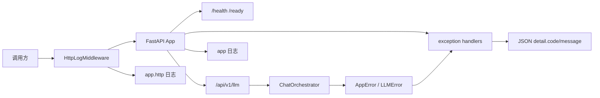
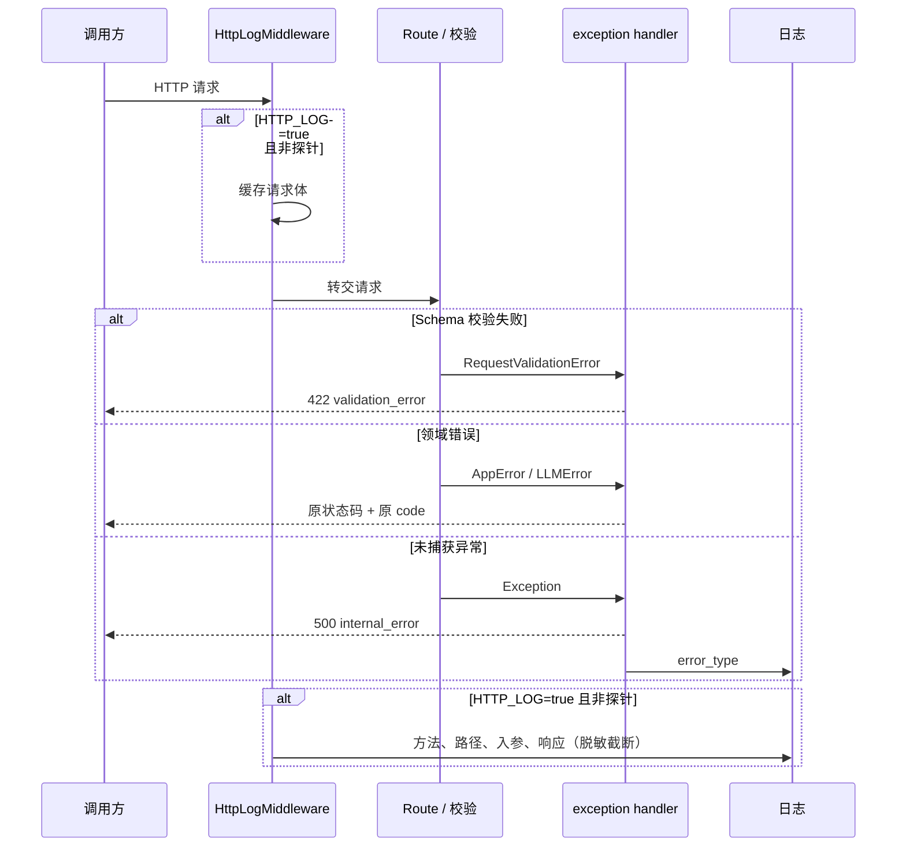
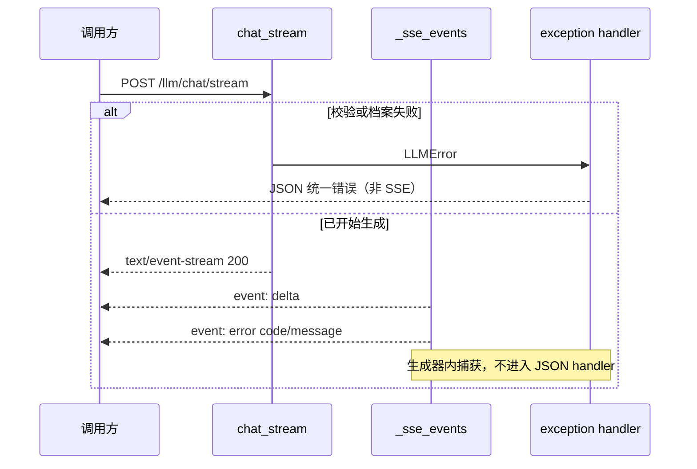

# FastAPI 工程基线详细设计

## 1. 文档信息

| 项目 | 内容 |
| --- | --- |
| 设计编号 | DESIGN-REQ-2026-003 |
| 关联需求 | [REQ-2026-003-engineering-baseline.md](../requirements/REQ-2026-003-engineering-baseline.md) |
| 关联数据库设计 | 不涉及 |
| 关联测试文档 | [TEST-REQ-2026-003-engineering-baseline.md](../test/TEST-REQ-2026-003-engineering-baseline.md) |
| 文档版本 | 0.2 |
| 文档状态 | 开发中 |
| 技术负责人 | 待指定 |
| 创建/更新日期 | 2026-09-11 |

## 2. 设计摘要

### 2.1 目标

1. 用 Ruff 作为唯一 Python lint/格式化工具，配置和命令进入仓库。
2. 在应用入口注册统一异常处理：JSON 失败一律 `{"detail":{"code","message"}}`，LLM 已发布错误码保持不变。
3. 配置应用日志级别；新增独立开关 `HTTP_LOG` 打印请求入参和响应，默认关闭。
4. 成功资源模型、`/health`、`/ready`、SSE 事件协议不改。

### 2.2 非目标

- 不引入成功响应信封，不把业务失败改成 HTTP 200。
- 不改 `/ready` 的 503 就绪模型，不把探针失败送进 JSON 错误出口。
- 不把 SSE 流中失败改成 JSON；不逐条记录 `delta`。
- 不建设 CI、类型检查、审计、脱敏产品、请求 ID、指标或追踪。
- 不引入新的业务路由或数据表。

### 2.3 需求映射

| 需求/验收标准 | 设计落点 | 验证方式 |
| --- | --- | --- |
| REQ-001 / AC-001～AC-003 | `pyproject.toml` 开发依赖与 `[tool.ruff]`；README 命令 | `uv run ruff check`、`uv run ruff format --check` |
| REQ-002 / AC-004～AC-006、AC-011 | `AppError` handler、`RequestValidationError` handler、LLM 路由改为直接抛领域异常 | pytest：档案 404/上游 503/成功体/缺 `messages` 的 422 对象 |
| REQ-003 / AC-007～AC-009 | 未捕获 `Exception` handler，正文固定 `internal_error` | pytest：测试中临时注入异常；`DEBUG=true` 正文仍无堆栈 |
| REQ-004 / AC-010、AC-012、AC-013 | handler 不拦截 `/ready` 本地 503；SSE 生成器仍发 `event: error` | pytest：就绪失败、流中失败、`/health` 与 `/` |
| REQ-005 / AC-014～AC-016 | `configure_logging`、`LOG_LEVEL`；领域错误日志只记 code/类型 | pytest + caplog |
| REQ-006 / AC-017～AC-022 | `HTTP_LOG`、ASGI 访问日志中间件、`.env.example` | pytest：开关开/关、探针排除、SSE 不逐条、密钥遮蔽 |

## 3. 改动范围

| 层次 | 模块/路径 | 主要改动 |
| --- | --- | --- |
| 工具链 | `pyproject.toml` | 增加 `ruff` 开发依赖与 `[tool.ruff]` |
| 应用入口 | `app/main.py` | 启动时配置日志、注册异常处理、挂载访问日志中间件 |
| 核心 | `app/core/errors.py`（新建） | 通用 `AppError` |
| 核心 | `app/core/exception_handlers.py`（新建） | 校验/领域/HTTP/未捕获异常转统一 JSON |
| 核心 | `app/core/logging.py`（新建） | 日志格式、级别、脱敏与截断 |
| 核心 | `app/core/http_log.py`（新建） | 可开关的请求/响应 ASGI 中间件 |
| 配置 | `app/core/config.py`、`.env.example` | `log_level`、`http_log` |
| Schema | `app/schemas/errors.py`（新建） | `ErrorDetail`；`LLMErrorBody` 改为同一形状或再导出 |
| LLM 错误 | `app/llm/errors.py` | `LLMError` 继承 `AppError`，错误码不变 |
| 路由 | `app/api/routes/llm.py` | 同步/流式校验阶段直接抛 `LLMError`，删除逐路由 `HTTPException` 转换；SSE 生成中仍本地捕获 |
| 文档 | `README.md` | Ruff 命令、`LOG_LEVEL`、`HTTP_LOG` |
| 测试 | `tests/test_errors.py`、`tests/test_http_log.py`，回归 `tests/test_llm.py` | 统一错误、500、访问日志开关 |
| 数据 | `doc/sql` | 不涉及 |
| 调用方 | JSON 错误客户端 | Schema 422 从数组改为对象，属需求确认的刻意变化；LLM 业务码不变 |

## 4. 架构与流程

### 4.1 架构图



### 4.2 关键时序图

JSON 失败：



SSE 流中失败：



### 4.3 主要流程

1. 进程导入 `main` 时调用 `configure_logging()`，按 `LOG_LEVEL` 设置 `app` 日志。
2. 创建 FastAPI 应用后注册异常处理和 `HttpLogMiddleware`。
3. 请求进入中间件：探针直接放行且不记录正文；`HTTP_LOG=false` 时不缓存 body。
4. JSON 业务路由抛出 `LLMError`/`AppError` 或框架校验异常，由 handler 写成统一 `detail`。
5. `/ready` 继续本地捕获 `SQLAlchemyError` 并返回 `ReadyResponse`，不进入 JSON 错误出口。
6. SSE 仅在生成器内把失败写成 `event: error`。

## 5. 模块设计

### 5.1 Schema

| 类型 | 名称 | 职责 |
| --- | --- | --- |
| 错误体 | `ErrorDetail` | `code: str`、`message: str`、可选 `errors`（校验字段列表） |
| 对外包装 | JSON `{"detail": ErrorDetail}` | 与现有 LLM `detail` 位置兼容 |
| 兼容别名 | `LLMErrorBody` | 保持 `code`/`message`，等于 `ErrorDetail` 的必填字段 |

校验失败允许附加 `errors`，对应 FastAPI `RequestValidationError.errors()` 的精简列表（`loc`/`msg`/`type`），便于定位字段。调用方只需依赖 `code` 与 `message`。

成功模型不改：`ChatResponse`、`LLMProfileListResponse`、`HealthResponse`、`ReadyResponse`、根路径字典。

### 5.2 路由与处理

| 类型 | 名称 | 职责 |
| --- | --- | --- |
| 注册 | `register_exception_handlers(app)` | 绑定四类 handler |
| 中间件 | `HttpLogMiddleware` | 按开关记录 HTTP 入参/返回 |
| LLM 同步 | `chat` | `await orchestrator.chat(...)`，不再 `except LLMError` |
| LLM 流式 | `chat_stream` | `prepare()` 失败自然抛出；`_sse_events` 仍捕获流中异常 |
| 探针 | `ready` | 保持本地 503，不改 |

不新增业务路由。测试用未捕获异常通过 pytest 临时挂载路径注入，不进入生产路由表。

### 5.3 核心规则

| 规则 | 实现位置 | 失败行为 |
| --- | --- | --- |
| `LLMError` 继承 `AppError` | `app/llm/errors.py` | 错误码与 HTTP 状态保持 001 |
| JSON 失败统一对象 | `exception_handlers` | 不返回字符串或数组作为唯一 `detail` |
| 探针不进错误出口 | `ready()` 本地捕获 | 503 `ReadyResponse` |
| SSE 流中失败走事件 | `_sse_events` | `event: error`，不再 `done` |
| 访问日志默认关 | `settings.http_log=False` | 不打印业务正文 |
| 密钥始终遮蔽 | `logging.redact` | 替换为 `***` |
| 不使用 `BaseHTTPMiddleware` | `http_log.py` | 纯 ASGI，避免缓冲 SSE |

`AppError` 字段：`code: str`、`message: str`、`status_code: int`。后续模块复用该类，不在本迭代预建空子类树。

## 6. HTTP API 契约

本需求不新增业务路径。对现有接口的失败形状如下。

| 方法 | 路径 | 成功 | 失败 |
| --- | --- | --- | --- |
| GET | `/` | 原字典 200 | 未捕获时 500 统一对象 |
| GET | `/health` | `HealthResponse` 200 | 不探库；未捕获时 500 统一对象 |
| GET | `/ready` | `ReadyResponse` 200 | 数据库失败仍 503 `ReadyResponse`，无 `detail.code` |
| GET | `/api/v1/llm/profiles` | `LLMProfileListResponse` 200 | 统一 JSON 错误 |
| POST | `/api/v1/llm/chat` | `ChatResponse` 200 | 统一 JSON 错误 |
| POST | `/api/v1/llm/chat/stream` | SSE 200 | 开始前：统一 JSON；开始后：`event: error` |
| 任意 | 未注册路径 | 无 | 404 `not_found` 统一对象 |

统一 JSON 失败体：

```json
{
  "detail": {
    "code": "validation_error",
    "message": "请求参数校验失败"
  }
}
```

稳定码：

| HTTP | `detail.code` | 来源 |
| --- | --- | --- |
| 422 | `validation_error` | Pydantic/FastAPI 校验，或 `LLMValidationError` |
| 404 | `profile_not_found` | LLM |
| 404 | `not_found` | 未注册路径或字符串 detail 的 404 |
| 405 | `method_not_allowed` | 方法不允许 |
| 503 | `profile_not_ready` / `upstream_timeout` / `upstream_failed` | LLM |
| 500 | `internal_error` | 未捕获异常 |
| 其他 | `http_error` | 其余字符串 `HTTPException`；若 `detail` 已是 `{code,message}` 则原样使用 |

固定文案：

- `validation_error`（框架校验）：`请求参数校验失败`
- `not_found`：`资源不存在`
- `method_not_allowed`：`方法不允许`
- `internal_error`：`服务器内部错误`
- `http_error`：`请求失败`
- LLM 业务 message 保持现有中文，不改码

接口补充：

- 成功体禁止增加 `data`/`code` 信封。
- 兼容策略：LLM 已发布业务码兼容；Schema 422 从数组改为对象，是刻意变化。
- OpenAPI 里 FastAPI 默认 422 schema 可能仍显示数组；**运行时以 handler 为准**，本迭代不改造 Swagger 生成器。
- 敏感字段：响应禁止堆栈、密钥、连接串。
- `DEBUG=true` 也不把堆栈写入 HTTP 正文。

## 7. 外部调用

不涉及新的外部 HTTP。LLM 上游调用仍由 REQ-2026-001 处理；本需求只改变失败如何从领域异常变成 HTTP JSON。

## 8. 数据设计

不涉及。无表、无缓存存储、无审计表。访问日志只写进程标准日志，不落库。

## 9. 事务、并发与缓存

| 主题 | 设计 |
| --- | --- |
| 本地写入边界 | 无业务写入 |
| 跨服务事务 | 不涉及 |
| 并发控制 | 不涉及 |
| 幂等 | 检查命令与只读探针可重复执行 |
| 缓存 | 不涉及。中间件按请求读取 `settings.http_log`，测试可切换，不缓存开关快照到进程启动值以外的错误状态 |

## 10. 认证与访问控制

- 认证方式：不涉及
- 操作权限：现有接口仍公开
- 数据归属：不涉及
- 敏感数据：
  - 响应：无密钥、无堆栈
  - 日志：见第 11 节
  - `HTTP_LOG=true` 时可能记录业务 messages，仅服务器日志可见；默认关闭

## 11. 异常与日志

### 11.1 异常处理

| 场景 | 处理 | 对外结果 | 数据影响 |
| --- | --- | --- | --- |
| Schema 非法 | `RequestValidationError` | 422 `validation_error`，可带 `errors` | 不改变 |
| LLM 领域错误 | `AppError` handler | 原 status + 原 code/message | 不改变 |
| 未注册路径/方法 | `StarletteHTTPException` | 404 `not_found` / 405 `method_not_allowed` | 不改变 |
| 已是 `{code,message}` 的 `HTTPException` | 原样放入 `detail` | 保持 LLM 过渡兼容 | 不改变 |
| `/ready` 连库失败 | 路由内捕获 | 503 `ReadyResponse` | 不改变 |
| SSE 流中 `LLMError` | 生成器 `event: error` | 流继续按 SSE 结束 | 不改变 |
| SSE 流中未声明异常 | 生成器记 `error_type`，发 `upstream_failed` | 与 001 一致 | 不改变 |
| 其他未捕获异常 | 通用 `Exception` handler | 500 `internal_error` | 不改变 |

`FastAPI(debug=...)` 不根据 `settings.debug` 打开框架调试页，避免响应泄露堆栈。

### 11.2 应用日志

- Logger 名：`app` 及子 logger（`app.http`、路由模块沿用 `logging.getLogger(__name__)`，即 `app.*`）。
- 格式：`%(asctime)s %(levelname)s [%(name)s] %(message)s`。
- 级别：`Settings.log_level`，环境变量 `LOG_LEVEL`，默认 `INFO`，取值 `DEBUG`/`INFO`/`WARNING`/`ERROR`。
- 与 `DEBUG` 独立：`DEBUG` 不自动打开 `HTTP_LOG`；`DEBUG=true` 或 `LOG_LEVEL=DEBUG` 时未捕获异常日志可带 `exc_info`，HTTP 正文仍无堆栈。
- 领域错误：`warning`，字段 `code`、`status`、异常类型；LLM 允许 `profile`。
- 未捕获：`error`，字段 `error_type`。
- 禁止明文：`password`、`token`、`key`、`api_key`、`authorization`、`cookie`、`database_url`、连接串。
- 不引入 JSON 日志平台。

### 11.3 请求/响应日志

配置：`Settings.http_log: bool = False`，环境变量 `HTTP_LOG`。

| 开关 | 行为 |
| --- | --- |
| `false` / 未配置 | 不打印请求体、查询入参、响应体 |
| `true` | 打印 `method`、`path`、查询、路径参数、JSON 体、状态码、响应体 |

排除与限制：

- 路径 `/health`、`/ready`：即使打开也不打印正文。
- `Content-Type: text/event-stream`：只记请求入参和 `stream=start`/`stream=end`（或失败），不拼接 `delta`。
- 单段正文超过 4096 字符则截断并加标记。
- 请求头 `Authorization`/`Cookie`/`X-API-Key` 记为 `***`。
- JSON 对象按字段名大小写不敏感递归遮蔽上述敏感键；值为疑似 URL 连接串时同样遮蔽。
- 实现必须是纯 ASGI 中间件，先缓存并回放 request body，再让 FastAPI 读取。

这不是审计：不落库、无查询 API。

## 12. 配置、发布与回滚

| Settings 字段 | 环境变量 | 默认 | 敏感 | 说明 |
| --- | --- | --- | :---: | --- |
| `debug` | `DEBUG` | `false` | 否 | 已有；不控制 HTTP 正文堆栈，不控制访问日志 |
| `log_level` | `LOG_LEVEL` | `INFO` | 否 | 应用日志级别 |
| `http_log` | `HTTP_LOG` | `false` | 否 | 请求/响应正文开关 |

`.env.example` 增加：

```text
LOG_LEVEL=INFO
# 打印 HTTP 入参和响应。开发可 true，生产默认 false
HTTP_LOG=false
```

Ruff（开发依赖，非运行时）：

```toml
[dependency-groups]
dev = ["pytest>=8.4.0", "ruff>=0.13"]

[tool.ruff]
target-version = "py312"
src = ["app", "tests"]
line-length = 120

[tool.ruff.lint]
select = ["E", "F", "I", "UP"]
```

命令（写入 README）：

```bash
uv run ruff check
uv run ruff format --check
uv run ruff format
uv run pytest
```

发布顺序：

1. 同步开发依赖并在交付前跑通 Ruff 与 pytest。
2. 发布应用。`HTTP_LOG` 默认关闭，生产无需新密钥。
3. 开发环境按需设 `HTTP_LOG=true`。

兼容窗口：新版本 Schema 422 不再是数组。依赖 FastAPI 默认 422 列表的客户端必须改为读 `detail.code`。LLM 业务码、成功体、探针、SSE 可并行。

回滚：回滚应用即可恢复旧 422 数组和路由内 `HTTPException` 转换。无数据库回滚。Ruff 配置回滚不影响运行时。

不可逆事项：无数据迁移。契约上 422 形状变化是有意的。

## 13. 验证计划

- 依赖：`uv sync --group dev`。
- 静态：`uv run ruff check`、`uv run ruff format --check`；确认无 Black/isort/flake8 并列依赖。
- pytest：
  - 回归 LLM：`profile_not_found`、`profile_not_ready`、上游 503、成功体无信封、流中 `error` 无 `done`
  - 缺 `messages`：422 且 `detail` 为对象、`code=validation_error`
  - 未注册路径：404 `not_found`
  - 临时路由抛 `RuntimeError("secret")`：500 `internal_error`，正文无 `secret`/traceback
  - `DEBUG=true` 下重复 500，正文仍无堆栈
  - `/ready` 失败仍无 `detail.code`
  - `/health`、`/` 200
  - `HTTP_LOG=false`：chat 日志无 messages 正文
  - `HTTP_LOG=true`：可见 method/path/入参/响应；Authorization 与 `key` 为 `***`；`/health` 无探针正文；SSE 无逐条 delta
- 未执行项：真实生产日志采集、CI。不以 pytest 代替人工看 `.env.example` 说明（AC-022 可用文件断言覆盖）。

## 14. 风险、评审与变更

| 编号 | 风险/问题 | 负责人 | 状态/结论 |
| --- | --- | --- | --- |
| DESIGN-ITEM-001 | 422 从数组改为对象，破坏依赖默认 FastAPI 校验体的客户端 | 待指定 | 已接受：需求确认统一错误 |
| DESIGN-ITEM-002 | `HTTP_LOG=true` 会把对话正文写入进程日志 | 待指定 | 默认关闭；密钥仍遮蔽；文档标明生产谨慎 |
| DESIGN-ITEM-003 | `BaseHTTPMiddleware` 与 SSE 冲突 | 待指定 | 已选纯 ASGI 中间件 |
| DESIGN-ITEM-004 | OpenAPI 默认 422 schema 可能仍显示数组 | 待指定 | 运行时 handler 为准，本迭代不改 Swagger 生成 |
| DESIGN-ITEM-005 | 通用 `Exception` handler 误伤 `/ready` | 待指定 | `/ready` 必须继续本地捕获 `SQLAlchemyError` |

| 评审领域 | 结论 | 评审人 | 日期 |
| --- | --- | --- | --- |
| 后端/API | 待评审 | 待指定 | 待指定 |
| 数据库 | 不涉及 | 待指定 | 待指定 |
| 测试可行性 | 待评审 | 待指定 | 待指定 |

| 日期 | 版本 | 变更内容 | 修改人 |
| --- | --- | --- | --- |
| 2026-09-11 | 0.1 | 初稿。Ruff、`AppError` 统一 JSON 错误出口、`LOG_LEVEL`、`HTTP_LOG` 访问日志中间件。 | 待指定 |
| 2026-09-11 | 0.2 | 记录实现完成范围、Ruff isort 本包识别、隔离 pytest 与 Ruff 检查结果。 | 待指定 |

## 15. 实现完成记录

开发完成，待验收。

- 实际完成范围：Ruff 开发依赖与 `[tool.ruff]`；`AppError`/`LLMError` 继承；统一异常处理（校验/领域/HTTP/未捕获）；`LOG_LEVEL` 与 `configure_logging`；纯 ASGI `HttpLogMiddleware`；`.env.example`/`README` 命令与开关说明；`tests/test_errors.py`、`tests/test_http_log.py` 及 LLM 回归。
- 设计偏差：
  1. 增加 `[tool.ruff.lint.isort] known-first-party = ["app", "tests"]`。仅配置 `src = ["app", "tests"]` 时 ruff 把这两个路径当作源码根，`from app...` 无法识别为本包，会打乱第三方/本包分组。
- 已执行验证：`uv run ruff check`、`uv run ruff format --check` 通过；`uv run pytest`，59 passed。
- 未执行项：CI、真实生产日志采集、真实 GPT 联调。OpenAPI 默认 422 schema 仍可能显示数组，运行时以 handler 为准。
- 环境限制：默认测试拦截真实模型工厂与 Session；未捕获 500 用例使用 `TestClient(raise_server_exceptions=False)`，因为 Starlette `ServerErrorMiddleware` 在调用 handler 后仍会再抛异常供服务器记录。
- 待验收项：评审需求/设计确认；依赖 FastAPI 默认 422 数组的客户端需改为读 `detail.code`。
