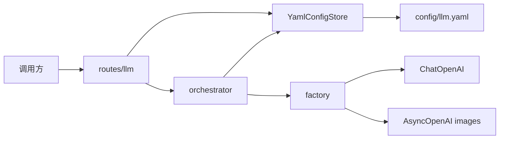

# LLM 完整配置项与文件 CRUD 详细设计

## 1. 文档信息

| 项目 | 内容 |
| --- | --- |
| 设计编号 | DESIGN-REQ-2026-004 |
| 关联需求 | [REQ-2026-004-llm-config-store.md](../requirements/REQ-2026-004-llm-config-store.md) |
| 关联数据库设计 | 不涉及 |
| 关联测试文档 | [TEST-REQ-2026-004-llm-config-store.md](../test/TEST-REQ-2026-004-llm-config-store.md) |
| 文档版本 | 0.1 |
| 文档状态 | 开发中 |
| 技术负责人 | 待指定 |
| 创建/更新日期 | 2026-09-11 |

## 2. 设计摘要

### 2.1 目标

1. 用 YAML 保存动态命名的完整 LLM 配置项，提供 HTTP CRUD。
2. 对话/图像调用改为必填 `config` + 选填 `fallback`。
3. OpenAI 支持 chat、responses、image.generate、image.edit。
4. 读接口与日志不出现明文 apikey。

### 2.2 非目标

- 不入库、不接 Anthropic 上游、不在 YAML 写 system。

### 2.3 需求映射

| 需求/验收标准 | 设计落点 | 验证方式 |
| --- | --- | --- |
| REQ-001 / AC-001 | `YamlConfigStore` 每项含 baseurl/apikey | pytest 两条配置互不覆盖 |
| REQ-001 / AC-002 | `ready` 判定；启动不读密钥 | pytest |
| REQ-002 / AC-003～006 | `/api/v1/llm/configs` CRUD | pytest + 临时 YAML |
| REQ-003 / AC-007～009 | `ChatRequest.config/fallback` | pytest 假上游 |
| REQ-004 / AC-010～012 | chat/images 路由与 api 校验 | pytest |
| REQ-005 / AC-013 | 编排不再插入 system | pytest |
| REQ-006 / AC-014～015 | 公开 Schema 无 apikey；示例空 key | pytest 静态检查 |

## 3. 改动范围

| 层次 | 模块/路径 | 主要改动 |
| --- | --- | --- |
| 配置 | `app/core/config.py`、`.env.example` | 删除嵌套 `llm` 档案；新增 `llm_config` |
| 存储 | `app/llm/store.py`、`config/llm.yaml` | YAML 读写 |
| 路由 | `app/api/routes/llm.py` | configs CRUD；chat 契约；图像接口 |
| Schema | `app/schemas/llm.py` | 配置与图像模型 |
| LLM | `app/llm/*` | Provider/工厂/编排按完整项工作 |
| 依赖 | `pyproject.toml` | 增加 `pyyaml` |
| 测试 | `tests/test_llm.py`、`tests/test_llm_config.py` | 重写 |

## 4. 架构与流程



## 5. 模块设计

YAML：

```yaml
configs:
  gpt-mini:
    protocol: openai
    api: chat
    baseurl: https://api.openai.com/v1
    apikey: ""
    timeout: 60
    model: gpt-4o-mini
    stream: false
    think: false
```

内部项字段：`name`、`protocol`、`api`、`baseurl`、`apikey`、`timeout`、`model`、`stream`、`think`、`think_level`、`temperature`、`size`、`quality`、`n`、`max_messages`、`max_length`、`ready`。

公开项去掉 `apikey`，增加 `has_key`。

工厂：`protocol=openai` 且 `api` 为 chat/responses 时建 `ChatOpenAI`（responses 设 `use_responses_api=True`）；图像用 `openai.AsyncOpenAI`。`think=true` 传 `reasoning_effort`。Anthropic 调用抛 `protocol_not_supported`。

编排：不插入系统提示；链 = 主配置 +（可选且就绪的 fallback）。

## 6. HTTP API 契约

| 方法 | 路径 | 请求 | 响应 |
| --- | --- | --- | --- |
| GET | `/api/v1/llm/configs` | 无 | 200 列表 |
| GET | `/api/v1/llm/configs/{name}` | 路径 | 200 / 404 |
| POST | `/api/v1/llm/configs` | 完整项+name | 201 / 409 / 422 |
| PUT | `/api/v1/llm/configs/{name}` | 完整项，apikey 可省略 | 200 / 404 |
| DELETE | `/api/v1/llm/configs/{name}` | 路径 | 204 / 404 |
| POST | `/api/v1/llm/chat` | `{config, fallback?, messages}` | 200 JSON 或 SSE |
| POST | `/api/v1/llm/chat/stream` | 同上 | SSE |
| POST | `/api/v1/llm/images/generate` | `{config, fallback?, prompt}` | 200 |
| POST | `/api/v1/llm/images/edit` | multipart | 200 |

原 `/api/v1/llm/profiles` 不再作为主入口，实现为 404 或移除。

错误码：`config_not_found` 404、`config_exists` 409、`config_not_ready` 503、`api_mismatch` 422、`protocol_not_supported` 503、`config_invalid` 500、`upstream_*` 503。

## 7. 外部调用

| 项目 | 内容 |
| --- | --- |
| chat/responses | `langchain_openai.ChatOpenAI`，`max_retries=0`，超时来自配置 |
| images | `openai.AsyncOpenAI.images.generate/edit` |
| Anthropic | 不调用 |

## 8. 数据设计

不涉及数据库。存储为 UTF-8 YAML。写操作：进程内锁 + 临时文件替换。并发最后写入生效。

## 9. 事务、并发与缓存

无库事务。工厂按配置指纹缓存聊天客户端，CRUD 写成功后清空缓存。不缓存模型输出。

## 10. 认证与访问控制

不涉及。GET 不回明文密钥。

## 11. 异常与日志

日志允许配置名、api、error_code。禁止 apikey、完整 messages、图像字节。

## 12. 配置、发布与回滚

`Settings.llm_config` 环境变量 `LLM_CONFIG`，缺省 `config/llm.yaml`。示例文件空密钥。本地可用 `config/llm.local.yaml`（gitignore）并改路径。

发布：先放示例 YAML 与新接口，再填密钥。回滚应用后旧 `/profiles` 与 `LLM__*` 环境变量已移除，调用方需改用 configs。

## 13. 验证计划

`uv sync --group dev`，`uv run ruff check`，`uv run ruff format --check`，`uv run pytest`。真实上游不在默认 pytest。

## 14. 风险、评审与变更

| 编号 | 风险/问题 | 状态 |
| --- | --- | --- |
| DESIGN-ITEM-001 | 无认证写接口 | 与需求一致，已接受 |
| DESIGN-ITEM-002 | 文件非多实例安全 | 已接受 |

| 日期 | 版本 | 变更内容 | 修改人 |
| --- | --- | --- | --- |
| 2026-09-11 | 0.1 | 初稿 | 待指定 |

## 15. 实现完成记录

开发完成，待验收。

- 实际完成范围：YAML 完整配置项、`GET/POST/PUT/DELETE /api/v1/llm/configs`、对话 `config`+`fallback`、SSE、图像生成/编辑、OpenAI chat/responses 工厂映射、隔离 pytest。
- 设计偏差：`POST /chat` 使用 `response_model=None`，以便 `stream=true` 时返回 SSE。
- 已执行验证：`uv run ruff check`、`uv run ruff format --check`、`uv run pytest`（53 passed）。
- 未执行项：真实上游联调。
- 环境限制：默认测试拦截真实工厂。
- 待验收项：填入真实 apikey 后验证四类接口。
