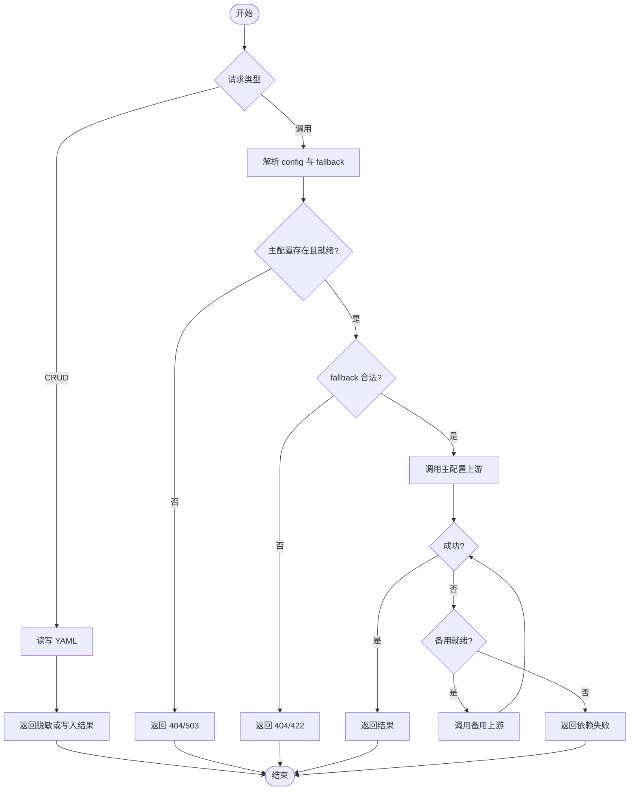

# LLM 完整配置项与文件 CRUD 需求文档

## 1. 文档信息

| 项目 | 内容 |
| --- | --- |
| 需求名称 | LLM 完整配置项与文件 CRUD |
| 需求编号 | REQ-2026-004 |
| 文档版本 | 0.1 |
| 所属模块 | llm |
| 目标版本/迭代 | fast-staratlas-ai 0.1 |
| 文档状态 | 开发中 |
| 产品负责人 | 待指定 |
| 技术负责人 | 待指定 |
| 创建日期 | 2026-09-11 |
| 最后更新日期 | 2026-09-11 |
| 关联事项 | 索引：[`doc/requirements-index.md`](../requirements-index.md)；详细设计：[DESIGN-REQ-2026-004-llm-config-store.md](../design/DESIGN-REQ-2026-004-llm-config-store.md)；数据库设计：不涉及；测试文档：[TEST-REQ-2026-004-llm-config-store.md](../test/TEST-REQ-2026-004-llm-config-store.md)。兼容对象：[REQ-2026-001](REQ-2026-001-llm-access-orchestration.md) |

## 2. 摘要与目标

### 2.1 摘要

模型接入改为「每条都是完整配置项」：名称动态、自带协议、接口、baseurl、apikey 和模型参数，写入 YAML 文件并提供增删改查。调用方每次传入主配置名和可选备用配置名。系统提示不进本文件。本迭代接通 OpenAI 的 chat、responses、图像生成和图像编辑。

### 2.2 需求目标

1. 可用 YAML 保存任意数量的完整模型配置，支持并行多条（不同地址和密钥互不影响）。
2. 调用方能通过 HTTP 动态列出、读取、创建、更新、删除配置；读接口不返回明文密钥。
3. 对话与图像调用必须指定配置名，可选指定备用配置名；主配置失败且备用就绪时改打备用。
4. 同一套配置可表达 chat、responses、图像生成、图像编辑；入口与 `api` 不匹配时拒绝。
5. 缺少密钥时服务可启动，未就绪配置不能作为成功调用目标。

### 2.3 非目标

- 不把配置接入数据库，不提供多实例共享存储。
- 不实现 Anthropic 上游调用（配置允许保存 `protocol=anthropic` 且 `api=chat`，调用时明确失败）。
- 不在模型配置中保存系统提示、全局 default 或全局 fallbacks。
- 不内置 `fast`/`smart` 名称。
- 不实现登录、认证、权限、审计、脱敏、热加载平台。
- 不把完整配置对象（含密钥）放到对话/图像请求体中。

## 3. 用户故事与范围

### 3.1 用户故事

| 故事编号 | 优先级 | 用户故事 | 典型场景 | 依赖 |
| --- | --- | --- | --- | --- |
| US-001 | Must | 作为维护者，我希望每条配置都含路径和密钥，以便多条供应商并行。 | 新增 `gpt-mini` 与 `deepseek-r1` 两套完整项 | 无 |
| US-002 | Must | 作为维护者，我希望对配置做增删改查且不入库，以便项目保持轻量。 | POST/GET/PUT/DELETE 配置 | US-001 |
| US-003 | Must | 作为调用方，我希望动态获取当前配置列表，以便选择本次使用的配置。 | GET 配置列表后发起对话 | US-002 |
| US-004 | Must | 作为调用方，我希望每次传入主配置和备用配置，以便主失败时改打备用。 | POST 对话带 `config` 与 `fallback` | US-003 |
| US-005 | Must | 作为调用方，我希望按配置的 `api` 调用对话或图像接口。 | chat/responses/生图/改图 | US-004 |
| US-006 | Must | 作为编排者，我不希望系统提示写在模型配置里，以便提示词由请求或编排层决定。 | 仅用户消息的对话 | US-004 |

### 3.2 范围内

- YAML 文件存储，路径由 `LLM_CONFIG` 配置，缺省 `config/llm.yaml`。
- 动态命名的完整配置项；CRUD HTTP。
- 对话请求必填 `config`、选填 `fallback`。
- OpenAI：`chat`、`responses`、`image.generate`、`image.edit`。
- 读接口脱敏密钥；写接口接受 `apikey`；PUT 省略 `apikey` 时保留原值。

### 3.3 范围外

- 数据库表、多实例文件同步、配置热更新平台。
- Anthropic 真实调用。
- 模型配置内的 system / 全局 default / 全局 fallbacks。
- 调用请求中的密钥、地址覆盖。

## 4. 业务流程

### 4.1 流程说明

- 前置条件：服务已启动。YAML 不存在视为空配置集。
- 触发入口：配置 CRUD；对话与图像 HTTP。
- 最终结果：配置变更写入 YAML；调用成功返回业务结果或明确失败。

1. 维护者创建完整配置项并写入文件。
2. 调用方列出配置，选择主配置和可选备用。
3. 系统校验名称存在、主配置就绪、两份 `api` 同类。
4. 按入口调用上游；主配置失败且备用就绪则改打备用。
5. 成功返回结果并标明实际使用的配置名。

### 4.2 业务流程图

### 4.3 异常与替代流程

| 编号 | 触发条件 | 系统行为 | 用户提示 | 数据是否改变 |
| --- | --- | --- | --- | :---: |
| EX-001 | 创建重名 | 拒绝 | 409 `config_exists` | 否 |
| EX-002 | 更新/删除不存在 | 拒绝 | 404 `config_not_found` | 否 |
| EX-003 | 主配置不存在 | 不调用上游 | 404 `config_not_found` | 否 |
| EX-004 | 主配置未就绪 | 不调用、不转备用 | 503 `config_not_ready` | 否 |
| EX-005 | fallback 不存在 | 不调用 | 404 `config_not_found` | 否 |
| EX-006 | 两份 api 不同类 | 不调用 | 422 `api_mismatch` | 否 |
| EX-007 | 入口与 api 不匹配 | 不调用 | 422 `api_mismatch` | 否 |
| EX-008 | 上游失败且备用不可用 | 依赖失败 | 503 | 否 |
| EX-009 | Anthropic 调用 | 明确不支持 | 503 `protocol_not_supported`，可转备用 | 否 |
| EX-010 | YAML 非法 | 拒绝该次读写 | 500 `config_invalid` | 否 |

## 5. 功能需求与验收标准

### 5.1 REQ-001 完整配置项与文件存储

#### 5.1.1 需求说明

- 关联用户故事：`US-001`
- 优先级：Must
- 每条配置至少包含：`protocol`、`api`、`baseurl`、`apikey`、`timeout`、`model`、`stream`。
- 文本类可含 `think`、`think_level`、`temperature`、`max_messages`、`max_length`。
- 图像类可含 `size`、`quality`、`n`。
- `api`：`chat` / `responses` / `image.generate` / `image.edit`。
- 无内置名称；文件无 `system`。
- 就绪：`apikey` 与 `model` 均非空。

#### 5.1.2 验收标准

- `AC-001`：Given YAML 含两条不同 `baseurl`/`apikey` 的配置，When 分别读取，Then 各用自己的地址和密钥，互不影响。
- `AC-002`：Given 配置缺少 apikey，When 查询，Then `ready=false` 且服务仍可启动。

### 5.2 REQ-002 配置增删改查

#### 5.2.1 需求说明

- 关联用户故事：`US-002`、`US-003`
- 优先级：Must
- GET 列表与详情不返回明文 `apikey`，返回 `has_key`；详情返回 `baseurl`。
- POST 创建完整项；重名 409。
- PUT 整单替换；省略 `apikey` 保留原密钥。
- DELETE 删除；不存在 404。
- 变更写入 `LLM_CONFIG` 指向的 YAML。

#### 5.2.2 验收标准

- `AC-003`：Given 合法创建请求，When POST，Then 201 且文件中可再 GET 到该名称，响应无明文密钥。
- `AC-004`：Given 已存在同名配置，When 再次 POST，Then 409。
- `AC-005`：Given 更新时省略 apikey，When PUT，Then 原密钥仍可用于调用就绪判定。
- `AC-006`：Given 删除已存在配置，When DELETE 后再 GET，Then 404。

### 5.3 REQ-003 请求传入主配置与备用

#### 5.3.1 需求说明

- 关联用户故事：`US-004`
- 优先级：Must
- 对话/图像请求必填 `config`，选填 `fallback`。省略 `config` → 422。
- 主未就绪不转备用。fallback 名称不存在 → 404。api 不同类 → 422。
- 调用方不能在请求中覆盖 baseurl/apikey/model。

#### 5.3.2 验收标准

- `AC-007`：Given 主配置失败且 fallback 就绪且 api 同类，When 对话，Then 成功且实际配置为 fallback。
- `AC-008`：Given 省略 config，When 对话，Then 422 且不调用上游。
- `AC-009`：Given 请求携带 apikey 或 baseurl，When 对话，Then 422。

### 5.4 REQ-004 按 api 分流调用

#### 5.4.1 需求说明

- 关联用户故事：`US-005`
- 优先级：Must
- `chat`/`responses` → `/api/v1/llm/chat` 与 `/chat/stream`。
- `image.generate` → `/api/v1/llm/images/generate`。
- `image.edit` → `/api/v1/llm/images/edit`（multipart：image、prompt，可选 mask）。
- `/chat/stream` 始终 SSE；`/chat` 在配置 `stream=true` 时返回 SSE，否则 JSON。
- `think=true` 时上游使用对应思考参数；图像配置禁止 `think=true`。

#### 5.4.2 验收标准

- `AC-010`：Given `api=chat` 的就绪配置，When POST `/chat`，Then 返回助手文本和实际 `config`。
- `AC-011`：Given `api=image.generate` 的配置去 POST `/chat`，When 提交，Then 422 `api_mismatch`。
- `AC-012`：Given 就绪生图配置，When POST generate 且假上游成功，Then 返回图像结果和实际 `config`。

### 5.5 REQ-005 提示词不在模型配置中

#### 5.5.1 需求说明

- 关联用户故事：`US-006`
- 优先级：Must
- YAML 与 CRUD 不含 `system`。
- 发给模型的消息仅为调用方 `messages`，服务不从模型配置插入系统提示。

#### 5.5.2 验收标准

- `AC-013`：Given 仅一条 user 消息，When 对话成功，Then 假上游收到的首条不是服务端注入的系统提示。

### 5.6 REQ-006 密钥安全底线

#### 5.6.1 需求说明

- 优先级：Must
- 示例 YAML 与文档不含真实密钥。
- GET 响应、常规日志不含明文 apikey。

#### 5.6.2 验收标准

- `AC-014`：Given 任意配置 GET，When 检查 JSON，Then 无 `apikey` 字段或明文密钥。
- `AC-015`：Given 查看仓库示例 YAML，When 检查 apikey，Then 为空。

## 6. 业务规则与状态

| 规则编号 | 规则 | 适用范围 | 违反时行为 |
| --- | --- | --- | --- |
| BR-001 | 每条配置自带 baseurl 与 apikey，不共享协议级凭据 | 存储与调用 | 各自使用自身字段 |
| BR-002 | 调用只传配置名，不传密钥和地址 | 对话/图像 | 422 |
| BR-003 | 主配置未就绪不走备用 | 调用 | 503 |
| BR-004 | 备用仅处理上游失败 | 调用 | 校验失败不转移 |
| BR-005 | 配置名动态，无内置 fast/smart | CRUD | 以文件为准 |
| BR-006 | 系统提示不属于本配置 | YAML/CRUD | 拒绝未知字段或忽略 |
| BR-007 | 无认证；拒绝只来自校验、不存在、未就绪、上游失败 | 全部 | 不引入权限项 |

不适用状态机。配置无业务状态，仅 `ready` 由密钥和模型名决定。

## 7. 认证与访问边界

不涉及。当前仓库无认证。本需求不增加登录。配置 CRUD 公开可写，风险已知，本迭代接受。

审计、脱敏：不涉及。仅遵守不输出明文密钥的安全底线。

## 8. 页面与交互要求

不适用。纯后端 HTTP。

## 9. 质量要求与影响

### 9.1 非功能要求

| 类别 | 要求 | 验证标准 |
| --- | --- | --- |
| 安全 | GET 无明文密钥；示例文件空 key | AC-014、AC-015 |
| 兼容性 | 替换 REQ-2026-001 的环境变量档案与 `/profiles` 主入口 | 设计与 README |
| 可用性 | 缺密钥可启动；文件不存在视为空集 | AC-002 |

### 9.2 数据与接口影响

| 影响项 | 是否涉及 | 需求层说明 | 关联设计 |
| --- | :---: | --- | --- |
| 数据实体 | 否 | YAML 文件，无表 | 不涉及数据库设计 |
| API | 是 | 配置 CRUD；对话改 `config`/`fallback`；新增图像接口 | 详细设计 |
| 配置/部署 | 是 | `LLM_CONFIG`；移除嵌套 `LLM__*` 档案环境变量 | 详细设计 |
| 外部依赖 | 是 | OpenAI chat/responses/images | 详细设计 |

### 9.3 依赖、风险与开放问题

| 编号 | 类型 | 内容 | 状态/结论 |
| --- | --- | --- | --- |
| ITEM-001 | 风险 | 无认证的配置写接口可改密钥 | 已接受：本迭代无认证 |
| ITEM-002 | 风险 | 文件存储无多实例一致性 | 已接受：保持轻量 |
| ITEM-003 | 依赖 | 真实上游联调需密钥 | 开放：默认 pytest 用假上游 |

## 10. 评审与变更

### 10.1 需求评审清单

- [ ] 摘要、目标、非目标和范围已明确。
- [ ] 每项 Must 需求都有可测试的验收标准。
- [ ] 数据库、API、配置影响已识别。

### 10.2 评审结论

| 评审领域 | 结论 | 评审人 | 日期 |
| --- | --- | --- | --- |
| 产品范围 | 待评审 | 待指定 | 待指定 |

### 10.3 变更记录

| 日期 | 版本 | 变更内容 | 原因 | 影响范围 | 修改人 |
| --- | --- | --- | --- | --- | --- |
| 2026-09-11 | 0.1 | 初稿。文件化完整配置项、CRUD、请求传 config+fallback、OpenAI 四类接口。 | 用户确认方案 | 新增 004 文档链、替换 001 配置契约 | 待指定 |
