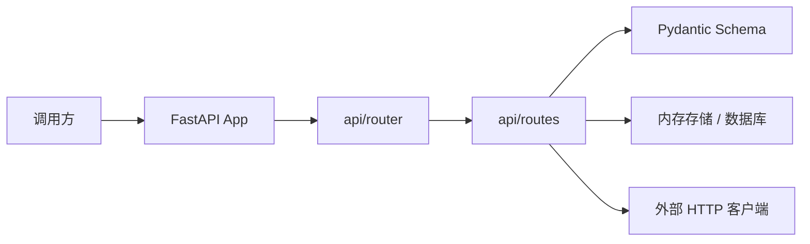
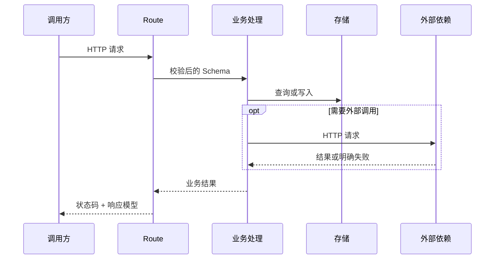

# 详细设计文档模板

> 复制后将标题改为“[功能名称]详细设计”，文件名使用 `DESIGN-REQ-YYYY-NNN-short-name.md`。本模板面向 fast-staratlas-ai 的 FastAPI 服务。

## 0. 使用说明

- 必填：需求映射、模块范围、架构图、关键时序图、HTTP 契约、数据影响、写入边界、发布回滚和验证。
- 需求文档回答做什么，本文件回答怎么实现；字段和 SQL 细节引用数据库设计。
- 不涉及的章节写明“不涉及”及原因，避免保留空占位内容。

## 1. 文档信息

| 项目 | 内容 |
| --- | --- |
| 设计编号 | DESIGN-REQ-YYYY-NNN |
| 关联需求 | [需求文档链接] |
| 关联数据库设计 | [数据库设计链接 / 不涉及] |
| 文档版本 | 0.1 |
| 文档状态 | 草稿 / 评审中 / 已确认 / 开发中 / 已实现 / 已废弃 |
| 技术负责人 | 待指定 |
| 创建/更新日期 | YYYY-MM-DD |

## 2. 设计摘要

### 2.1 目标

1. [需要实现的后端能力]
2. [需要保证的兼容性、安全性或稳定性]

### 2.2 非目标

- [本次不实现的能力]

### 2.3 需求映射

| 需求/验收标准 | 设计落点 | 验证方式 |
| --- | --- | --- |
| REQ-001 / AC-001 | [路由、Schema 或配置] | [pytest、接口或人工验证] |

## 3. 改动范围

| 层次 | 模块/路径 | 主要改动 |
| --- | --- | --- |
| 应用入口 | `app/main.py` | [不涉及 / 挂载或根路径] |
| 路由 | `app/api/routes/`、`app/api/router.py` | [新增或调整 APIRouter] |
| Schema | `app/schemas/` | [请求/响应模型] |
| 配置 | `app/core/config.py`、`.env.example` | [不涉及 / Settings 字段] |
| 数据 | 内存存储 / `doc/sql` | [不涉及 / 持久化及脚本] |
| 测试 | `tests/` | [TestClient 用例] |
| 调用方 | [客户端或其他服务] | [不涉及 / 契约变化] |

## 4. 架构与流程

### 4.1 架构图

### 4.2 关键时序图

### 4.3 主要流程

1. [入口校验和上下文获取]
2. [核心业务处理]
3. [数据、缓存或外部调用处理]
4. [统一响应及错误转换]

## 5. 模块设计

### 5.1 Schema

| 类型 | 名称 | 职责 |
| --- | --- | --- |
| 请求模型 | `[XxxCreate]` | 写入或复杂查询输入 |
| 响应模型 | `[XxxItem]` | 对外响应模型 |
| 列表模型 | `[XxxListResponse]` | 列表总量与条目 |

### 5.2 路由与处理

| 类型 | 名称 | 职责 |
| --- | --- | --- |
| Router | `[xxx.router]` | 路径、标签、状态码和 `response_model` |
| 处理函数 | `[list/get/create_...]` | 参数校验、业务规则和错误转换 |
| 存储 | [内存字典 / Repository] | 数据读写边界 |

### 5.3 核心规则

| 规则 | 实现位置 | 失败行为 |
| --- | --- | --- |
| [唯一性/状态/版本规则] | [路由处理 / 数据库] | [HTTP 错误且不改变数据] |

## 6. HTTP API 契约

| 方法 | 路径 | 权限/身份 | 请求 | 响应 | 幂等/并发 |
| --- | --- | --- | --- | --- | --- |
| GET | `/api/v1/xxx` | [公开/已登录] | Query | `XxxListResponse` | 只读 |
| GET | `/api/v1/xxx/{id}` | [公开/已登录] | Path | `XxxItem` / 404 | 只读 |
| POST | `/api/v1/xxx` | [公开/已登录] | `XxxCreate` | `XxxItem` 201 | [填写] |

接口补充：

- 参数位置与校验：[填写]
- 业务错误码、HTTP 状态和提示：[填写]
- 兼容策略：[新增接口 / 保持旧接口 / 版本切换]
- 大字段、敏感字段和日志限制：[填写]

## 7. 外部调用

| 项目 | 内容 |
| --- | --- |
| 目标服务 | [名称与用途 / 不涉及] |
| 客户端位置 | [模块路径] |
| 超时与重试 | [填写] |
| 失败处理 | 返回明确失败，不把空结果当作成功 |
| 调用方处理 | 必须区分成功、业务失败和依赖失败 |

不涉及外部调用时，本节写“不涉及”。

## 8. 数据设计

- 数据库设计：[链接 `DB-REQ-...` / 不涉及]
- 存储方式：[进程内内存 / 指定数据库产品]
- 持久化边界：[重启丢失 / 事务 / 逻辑删除]
- 唯一约束和索引：[摘要]
- 全量及升级脚本：[路径 / 不涉及]

当前 Demo 若仍使用内存存储，必须标明非持久化，不得暗示已落库。

## 9. 事务、并发与缓存

| 主题 | 设计 |
| --- | --- |
| 本地写入边界 | [提交和失败回退边界] |
| 跨服务事务 | [不涉及 / 补偿方式] |
| 并发控制 | [唯一约束、乐观锁、版本检查或锁] |
| 幂等 | [幂等键、重复请求行为] |
| 缓存 | [Key、TTL、更新/失效顺序和一致性 / 不涉及] |

## 10. 认证与访问控制

- 认证方式：[不涉及 / 复用现有安全上下文]
- 操作权限：[公开 / 角色 / 资源所有权校验]
- 数据归属：[无 / 归属字段来源和越权拒绝行为]
- 敏感数据：[入参、响应、日志、缓存和导出限制]

## 11. 异常与日志

| 场景 | 处理 | 对外结果 | 数据影响 |
| --- | --- | --- | --- |
| 参数或状态非法 | Pydantic 或业务校验失败 | 422/明确业务错误 | 不改变 |
| 数据不存在 | 返回不存在错误 | 404，不返回旧数据 | 不改变 |
| 外部依赖失败 | 超时或明确失败 | 调用方不得当作成功 | 按写入设计 |
| 存储异常 | 记录业务标识和异常 | 统一错误 | 回退 |

日志不得记录密码、Token、密钥、连接串或完整敏感请求体。

## 12. 配置、发布与回滚

- 配置项：[Settings 字段、环境变量、默认值、环境差异 / 不涉及]
- 发布顺序：数据库脚本（如有） -> 应用发布 -> 配置启用 -> 调用方。
- 兼容窗口：[新旧版本能否并行]
- 回滚顺序：[调用方/应用/配置/数据库]
- 不可逆事项：[无 / 说明]

## 13. 验证计划

- 依赖与测试：`uv sync --group dev`，`uv run pytest`。
- 静态检查：路由注册、Schema 签名、配置项、SQL 和文档链接。
- 测试：记录需覆盖的接口、存储、并发、缓存、外部失败和回滚场景。
- 未执行项和环境限制必须明确记录，不以 pytest 代替业务验收。

## 14. 风险、评审与变更

| 编号 | 风险/问题 | 负责人 | 状态/结论 |
| --- | --- | --- | --- |
| DESIGN-ITEM-001 | [填写] | 待指定 | 开放 |

| 评审领域 | 结论 | 评审人 | 日期 |
| --- | --- | --- | --- |
| 后端/API | 通过/有条件/不通过 | [填写] | YYYY-MM-DD |
| 数据库 | 通过/有条件/不通过 | [填写] | YYYY-MM-DD |
| 测试可行性 | 通过/有条件/不通过 | [填写] | YYYY-MM-DD |

| 日期 | 版本 | 变更内容 | 修改人 |
| --- | --- | --- | --- |
| YYYY-MM-DD | 0.1 | 初稿 | [填写] |
